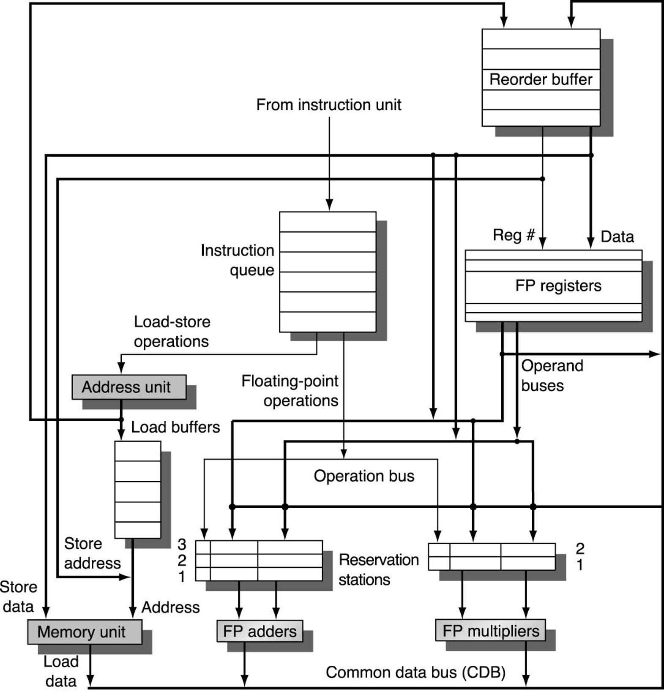

# ECE 411: mp_ooo WHAT_IS_AN_OOO

Below is a guide explaining out-of-order processors and some details on Tomasulo's Algorithm and Explicit Register Renaming.

## Why Out-of-Order?

Out-of-order architectures are popular for high-performance CPU architectures. They (ideally) reduce performance penalties due to false dependencies between nearby instructions.

For example, consider the following simple program:

```
1: LOAD 0x12345678, x1 // load value at address into x1 

2: ADD x1, x1, x2 // add x1 to itself and put into x2

3: MUL x3, x3, x4 // multiply x3 with itself and put into x4
```

Here, instruction 2 is dependent on the result of instruction 1, but instruction 3 is independent of both 1 and 2.

Assume the following:
- LOADs have a latency of 20 cycles
- ADDs have a latency of 1 cycle
- MULTs have a latency of 20 cycles

In an in-order pipelined processor, we would need to sequentially handle instructions 1-3. The imbalance between instructions 1 and 2 results in a severe performance penalty, as instruction 2 will sit in the decode stage for 20 cycles while the LOAD waits for the data, and instruction 3 will be stuck in fetch. This means the total latency would be ~45 cycles (+/- a few).

In an out-of-order processor, the dependency logic should identify that MULT is independent of the LOAD. Thus, the MULT will execute before the ADD, overlapping most of the MULT latency with LOAD. The latency should now be ~25 cycles (+/- a few)

The above calculations are very rough (back of the envelope), but the conclusion is clear. Out-of-order processors enable us to overlap handling long latency instructions with other long latency instructions (or multiple short latency instructions), which can dramatically improve performance.  

## What is Tomasulo's Algorithm + ROB?

Tomasulo's Algorithm is an algorithm for out-of-order execution. It enables instructions without data dependencies to overlap and/or reorder execution. This is done via reservation stations which keep track of instruction dependencies and only schedule instructions once those dependencies have been resolved.

Tomasulo's Algorithm does not directly support precise state. For our purposes, precise state means that the programmer (or OS) sees register/memory changes as if they were modified in order. In other words, if the programmer were to pause execution at any point in time, they should see a program & memory state identical to as if it was executed in order.

In order for Tomasulo's Algorithm to support precise state, an additional structure called a reorder buffer (ROB) is necessary. The ROB holds the instructions in order and waits for instructions to finish executing. Once an instruction finishes executing and is the oldest instruction in the ROB, then it can commit, ensuring instructions commit from the ROB in order. When an instruction commits, the architectural register file is updated and stores have their values written to memory.

## Tomasulo's Algorithm Details

These are the key components of Tomasulo's Algorithm (+ Precise State) and when you will implement them during this MP:

- Fetch Logic [CP1 initially + CP3 when you work with the caches]
- Decoder [CP2]
- The ROB [CP2]
- The Reservation Stations [CP2]
- The Functional Units [CP2]
- The Common Data Bus (CDB) [CP2]
- The Register File [CP2]
- Load/Store Queues [CP3]
- Branch Resolution [CP3]

You can (and should) reuse logic from earlier MPs to implement the fetch logic, decode logic, functional units, and register file.

Below is a high-level overview of the Tomasulo architecture (taken from lecture). Many details are not shown. Furthermore, this diagram assumes only floating point instructions (which you do not need to support). You need to support out-of-order execution of the base RV32I ISA. Thus, it is imperative that you take the time to draw out a more detailed diagram during CP1 that more closely matches what you will be developing. 

Please refer to lecture for more details on how these hardware blocks interact.

<p align="center">
  
  <p align="center">Tomasulo's Algorithm</p>
</p>

## Tomasulo's Algorithm Limitations

Tomasulo's Algorithm is not perfect, as it has a number of limitations that result in increased area and power consumption. Here are a few:

- It has high overhead due to being a read before issue algorithm. This means that register values must be stored in the reservation stations for each in-flight instruction, which is expensive in terms of area and power. 
- Register values are written twice, once to the ROB when an instruction finishes execution and once to the architectural register file once an instruction commits, which increases energy consumption per instruction executed.
- Instruction values may come from either the ROB or the architectural register file, increasing the amount of interconnect area needed to support the algorithm. 

## Explicit Register Renaming & Read After Issue


## Differences from Tomasulo

- new parts, and how they work

pictures (preferably)